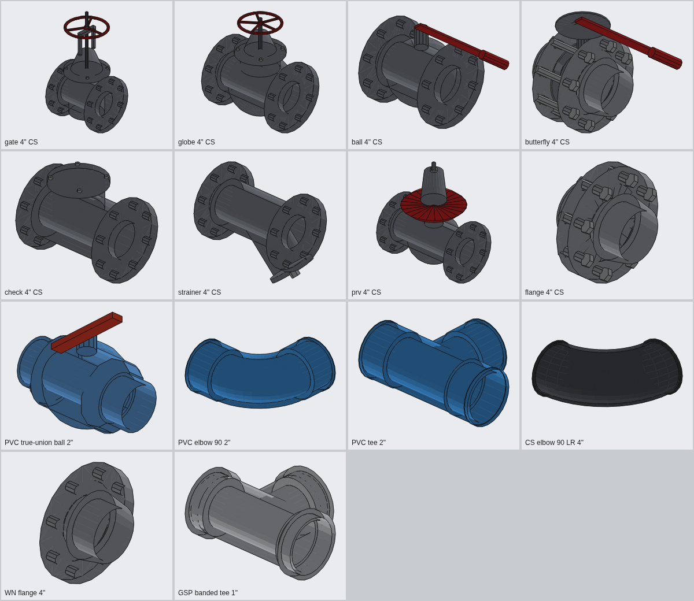

# Plant Piping TH – ปลั๊กอิน SketchUp สำหรับงานระบบท่อ

ปลั๊กอิน SketchUp สำหรับออกแบบ **ระบบน้ำประปา สุขาภิบาล และระบบท่อในโรงงานอุตสาหกรรม**
วาดแนวท่อแล้วได้ท่อ 3 มิติ ข้องอ และสามทาง (Tee) ตามขนาดมาตรฐานโดยอัตโนมัติ ใส่วาล์วได้
คำนวณขนาดท่อ ตรวจสอบไฮดรอลิก ตรวจการชนกัน และถอดปริมาณวัสดุ (BOM) ส่งออกเป็น Excel ได้

> Water, plumbing and industrial process piping for SketchUp: standard-dimension pipes,
> automatic elbows/tees, valves, pipe supports, pipe sizing, hydraulic & clash checks and a purchasing BOM.


---

## คุณสมบัติหลัก

| กลุ่ม | ความสามารถ |
|---|---|
| **ท่อกลวงจริง** | ท่อมีความหนาผนังตามมาตรฐาน · ท่อสวม (PVC/PP-R/ทองแดง) มีบ่าข้อต่อ (socket hub) และท่อเสียบลึกเข้าข้อต่อตามจริง · ข้อต่อเกลียว (GSP) มีแถบขอบ (banded) · ท่อเหล็กเชื่อมมีแนวเชื่อม · HDPE มีแนว bead เชื่อมชน |
| **วาดท่อ** | คลิกจุดแนวศูนย์กลาง → ได้ท่อ + ข้องอ 90°/45° อัตโนมัติ · พิมพ์ความยาวได้ · ล็อกแกนด้วยลูกศร · ล็อกทิศ 45°/90° (ใช้ข้อต่อมาตรฐานเท่านั้น) · ท่อยืน (riser) ตั้งฉากพอดี |
| **แยกท่อ / ต่อท่อ** | คลิกจุดแรกบนท่อเดิม = สร้าง **Tee / Reducing Tee** อัตโนมัติ · คลิกที่ปลายท่อเดิม = วาดต่อจากท่อนั้น (ใส่ข้องอให้เอง) |
| **แปลงเส้นเป็นท่อ** | วาดด้วย Line tool หรือ trace จากแบบ CAD แล้วแปลงเป็นท่อ – รองรับ Tee, Cross, Lateral (Wye 45°) |
| **ปรับแบบภายหลัง** | เปลี่ยนขนาด / วัสดุ / ระบบ ของแนวท่อที่วาดแล้วได้ทันที – วาล์วและ Tee ที่แยกออกไปปรับขนาดตามให้ |
| **ท่อระบาย (Gravity)** | ใส่ความลาดให้อัตโนมัติตามทิศทางการวาด (= ทิศทางการไหล) พร้อมเตือนความลาดต่ำกว่า IPC 704.1 |
| **วาล์ว** | 8 แบบ รูปทรงต่างกันชัดเจน: Gate (ก้านยก + พวงมาลัยซี่), Globe (ตัวกลม), Ball (ด้ามโยก) / PVC True-union ball, Butterfly (lever < 6", gearbox ≥ 6"), Swing Check (ฝาเอียง + ลูกศรทิศทาง), Y-Strainer, PRV (ไดอะแฟรม + สปริง), หน้าแปลนคู่ + ปะเก็น + สลักเกลียว · ขนาดตาม ASME B16.10 / หน้าแปลน B16.5 Class 150 มีรูน็อตจริง |
| **ซัพพอร์ต** | แบบแขวน: Clevis + เหล็กเส้นเกลียว (พุกฝ้า/พื้น), Beam clamp, Trapeze รางยูนิสตรัท 41×41, แขวนจากท่อใหญ่ · แบบติดพื้น: Pipe stand ปรับระดับ, H-frame, Sleeper + pipe shoe, Wall bracket · วางอัตโนมัติตามระยะห่างสูงสุด (MSS SP-69) และยึดกับพื้น/ฝ้า/คาน/ผนังที่มีในโมเดลเอง · ปรับขนาดตามเมื่อเปลี่ยนขนาดท่อ |
| **ฉนวน** | แสดงฉนวนแบบโปร่งแสง (Tag แยก) และรวมในการตรวจการชนกันและ BOM |
| **คำนวณขนาดท่อ** | ใส่อัตราไหล → ตารางความเร็ว/แรงเสียดทานทุกขนาด พร้อมขนาดแนะนำ · ท่อระบายใช้ Manning ที่ความลึกครึ่งท่อ |
| **ตรวจไฮดรอลิก** | ความเร็ว, แรงเสียดทาน (Darcy–Weisbach), ΣK ข้อต่อ/วาล์ว, ระดับสูง-ต่ำ, head รวม (m / bar) · ท่อดับเพลิงแสดง Hazen–Williams ด้วย · หา **จุดสูง/จุดต่ำ** แล้วแนะนำ Air vent / Drain / Steam trap |
| **ตรวจการชนกัน** | ตรวจระยะห่างระหว่างแนวท่อ (รวมฉนวนและหน้าแปลนวาล์ว) ทำเครื่องหมายตำแหน่งในโมเดล |
| **BOM** | ความยาวท่อ, **จำนวนท่อน** (เผื่อเศษตัด), น้ำหนัก (kg), ข้องอ/Tee/วาล์วแยกตามชนิด-ขนาด, ฉนวน, จำนวนรอยต่อโดยประมาณ → CSV เปิดใน Excel ภาษาไทยได้ทันที |
| **สี & ลายเส้น** | ค่าเริ่มต้น **สีตามวัสดุจริง** (PVC ฟ้า, PP-R เขียว, HDPE ดำ, เหล็กดำ, สแตนเลส, GSP, ทองแดง; ท่อดับเพลิงแดง, ท่อก๊าซเหลือง ตามสีทาจริง) · สลับเป็น แยกสีตามระบบ / ASME A13.1 / JIS Z 9102 ได้ทันที · ปุ่ม *ลายเส้นเทคนิค* เส้นขอบดำคมแบบแบบก่อสร้าง |
| **ความละเอียด 2 ระดับ** | *ละเอียด* (รูน็อต, ซี่พวงมาลัย, บ่าข้อต่อ, แนวเชื่อม) สำหรับนำเสนอ · *เบา* สำหรับโมเดลโรงงานขนาดใหญ่ · ข้อต่อ/วาล์วเป็น Component ใช้ซ้ำ ไฟล์ไม่หนัก |
| **หมายเลขท่อ** | อัตโนมัติรูปแบบ `SIZE-SERVICE-SEQ` เช่น `4"-FP-003` แยกลำดับตามระบบ |

## การติดตั้ง

1. ต้องใช้ **SketchUp 2021 ขึ้นไป** (Windows / macOS)
2. ดาวน์โหลดไฟล์ `dist/artk_plant_pipe-1.2.0.rbz`
3. SketchUp → **Extensions → Extension Manager → Install Extension** → เลือกไฟล์ `.rbz`
4. จะมีเมนู **Extensions → Plant Piping TH** และ Toolbar "Plant Piping TH"

> สร้างไฟล์ `.rbz` เองจากซอร์ส: `ruby tools/build_rbz.rb`

## เริ่มใช้งาน (ลำดับงานที่แนะนำ)

1. **ตั้งค่า** (ไอคอนเฟือง) → เลือก *ระบบท่อ* เช่น `FP – ท่อดับเพลิง` ระบบจะเลือกวัสดุ/ขนาด/ฉนวนเริ่มต้นที่เหมาะสมให้ ปรับเปลี่ยนได้
2. แท็บ **คำนวณขนาด** → ใส่อัตราไหล → กด *ใช้ขนาดแนะนำ*
3. **วาดท่อ** → คลิกจุดตามแนวท่อ → ดับเบิลคลิกหรือ Enter เพื่อจบ
4. **ใส่วาล์ว** → คลิกบนท่อตรง (Tab เปลี่ยนชนิด)
5. เลือกแนวท่อ → **กำหนดอัตราไหล** → **ตรวจไฮดรอลิก**
6. เลือกแนวท่อ → **วางซัพพอร์ตอัตโนมัติ** (หรือใช้ Support tool วางทีละจุด / Trapeze คลุมหลายท่อ)
7. **ตรวจการชนกัน** → แก้ไขแนวท่อ
8. **ถอดวัสดุ (BOM)** → Export CSV (รวมซัพพอร์ต เหล็กเส้นเกลียว และรางยูนิสตรัทเป็นเมตร)

### ขนาดท่อทำงานอย่างไร (สำคัญ)

- ขนาด/วัสดุ/ชั้นท่อในหน้าต่างตั้งค่า ใช้กับ **ท่อที่จะวาดใหม่** — แถบสถานะด้านล่างและตัวเลขข้างเคอร์เซอร์จะแสดงขนาดที่กำลังวาดเสมอ
- **เริ่มวาดที่ปลายท่อเดิม:**
  - ขนาดเดียวกัน → วาดต่อเป็นแนวเดียวกัน (ไม่มีรอยต่อ)
  - ขนาด/วัสดุต่างกัน → ใส่ **Reducer** (ตาม ASME B16.9) แล้วเริ่มแนวท่อใหม่ขนาดที่เลือก; ถ้าเลี้ยวด้วย ท่อเดิมจะได้ข้องอก่อน Reducer อัตโนมัติ
- **เปลี่ยนขนาดท่อที่วาดไปแล้ว:** เลือกแนวท่อ → ตั้งขนาดใหม่ → *ปรับท่อที่เลือก (Rebuild)* — วาล์ว ซัพพอร์ต และ Tee ที่แยกออกไปปรับตาม
- ถ้าท่อมีช่องว่าง/ข้อต่อหาย ให้รัน **Extensions → Plant Piping TH → Diagnostics** แล้วส่งภาพรายงานมา

### ใช้โมเดลวาล์วจริงของคุณ (สมจริงเหมือนของจริง)

ปลั๊กอินมีวาล์วในตัวแบบพาราเมตริก แต่ถ้าต้องการหน้าตาเหมือนของจริง ให้ใช้โมเดลจากผู้ผลิต / 3D Warehouse / ไฟล์ VALVEDATABASE ของคุณ:

1. เปิดไฟล์ที่มีวาล์ว → คัดลอกวาล์วที่ต้องการ → วางในโมเดลงาน (หรือ File → Import)
2. เลือกวาล์วนั้น → **Extensions → Plant Piping TH → Insert Valve Type → Register Valve Model**
   (หรือปุ่ม *ใช้โมเดลวาล์วของฉัน* ในหน้าต่างตั้งค่า)
3. คลิก **จุดศูนย์กลางขาเข้า** แล้ว **จุดศูนย์กลางขาออก** (ศูนย์กลางหน้าแปลน/ปลายต่อ – SketchUp จะ snap ที่ศูนย์กลางวงกลมให้)
4. เลือกชนิดวาล์ว, ขนาดที่ใช้ (หรือ *ทุกขนาด* = ปรับสเกลตามระยะหน้าต่อหน้า ASME B16.10), และแกนก้านวาล์วของโมเดล

ต่อจากนั้นวาล์วชนิดนั้นที่ใส่ใหม่ และทุกครั้งที่ Rebuild จะใช้โมเดลนี้ วางตรงแนวท่อ ก้านชี้ขึ้น ถูกนับใน BOM ตามปกติ
ลงทะเบียนแยกตามขนาดได้ (เช่น 2", 4", 6" คนละโมเดล) – ขนาดที่ตรงจะใช้ก่อน ไม่ปรับสเกล
โมเดลเก็บที่โฟลเดอร์ `PlantPipingLibrary` ในโฟลเดอร์ผู้ใช้ ใช้ได้กับทุกโปรเจกต์

### คีย์ลัดขณะวาดท่อ

| คีย์ | การทำงาน |
|---|---|
| คลิก | เพิ่มจุด |
| พิมพ์ตัวเลข + Enter | ความยาวตามทิศทางปัจจุบัน (ท่อระบาย = ความยาวในแปลน) |
| → / ← / ↑ | ล็อกแกนแดง / เขียว / น้ำเงิน · ↓ ปลดล็อก |
| Shift (กดค้าง) | ล็อกทิศทางปัจจุบัน |
| Backspace | ลบจุดล่าสุด |
| ดับเบิลคลิก / Enter | จบแนวท่อ |
| Esc | ยกเลิก |

**อ้างอิงระดับ BOP (Bottom of Pipe):** เมื่อคลิกบนพื้นผิว/ขอบ เช่น หลังคานรางท่อ (pipe rack) ท่อจะวางบนคานพอดี (ยกขึ้นครึ่ง OD)

## ซัพพอร์ตท่อ


| ชนิด | ใช้เมื่อ | ยึดกับ |
|---|---|---|
| Clevis hanger + threaded rod | ท่อเดี่ยวแขวนใต้พื้น/ฝ้า | พุก (drop-in anchor) ที่ผิวคอนกรีตด้านบน |
| Beam clamp + rod | แขวนจากคานเหล็กหลังคาโรงงานโดยไม่เจาะ | ปีกล่างของคานเหล็ก |
| Trapeze (strut 41×41) | หลายท่อวิ่งขนานกัน | 2 ก้านแขวน + U-bolt ทุกท่อ |
| Pipe-on-pipe | ท่อเล็กแขวนจากท่อใหญ่ด้านบน | แคลมป์รัดท่อใหญ่ |
| Adjustable pipe stand | ท่อเดี่ยวใกล้พื้น | แผ่นเพลทยึดพุก 4 ตัว |
| H-frame / Goalpost | หลายท่อบนพื้น (pipe rack เล็ก) | เสา 2 ต้น + คาน |
| Sleeper + pipe shoe | ท่อร้อน/ท่อหุ้มฉนวน ต้องเลื่อนตัวได้ | คานคอนกรีตรองท่อ (shoe สูง = ฉนวน + 50 mm) |
| Wall bracket | ท่อเลียบผนัง | แขนค้ำ + ค้ำยันเฉียง 45° |

**ระยะห่างสูงสุด:** เหล็ก MSS SP-69 / ASME B31.1 (เช่น 1" = 2.1 m, 2" = 3.0 m, 4" = 4.3 m, 6" = 5.2 m) ·
ทองแดง MSS SP-69 · PVC/PP-R ค่าผู้ผลิตทั่วไป (PP-R ท่อร้อน × 0.6 เพราะคืบตัวที่อุณหภูมิสูง) · HDPE ≈ 12 × OD ·
ซัพพอร์ตแรก/สุดท้ายห่างข้อต่อไม่เกิน 600 mm และมีซัพพอร์ตใกล้วาล์วทุกตัว (น้ำหนักรวมจุด) ·
ขนาดเหล็กเส้นเกลียวตาม MSS SP-58 (≤ 2" = 3/8" M10 … 4" = 5/8" M16)

**ยึดกับโครงสร้างจริง:** ปลั๊กอินยิงแนวตรวจ (ray) จากท่อขึ้น/ลง/ด้านข้าง หาพื้น ฝ้า คาน หรือผนังที่มีในโมเดล
(ข้ามท่อของตัวเอง) — ถ้าไม่พบจะใช้ค่าสมมติและแจ้งเตือน ดังนั้นควรมีโครงสร้างอาคารในโมเดลก่อนวางซัพพอร์ต

## ระบบท่อที่รองรับ

| รหัส | ระบบ | วัสดุเริ่มต้น | หมายเหตุ |
|---|---|---|---|
| CW | น้ำประปา/น้ำเย็น | PVC มอก.17 ชั้น 13.5 | v ≤ 2.0 m/s |
| HW / HWR | น้ำร้อน / น้ำร้อนไหลกลับ | PP-R PN20 + ฉนวน 25 | v ≤ 1.5 m/s |
| SAN | น้ำเสีย/โสโครก | PVC ชั้น 8.5 | Gravity, ความลาดอัตโนมัติ |
| V | ท่ออากาศ (Vent) | PVC ชั้น 5 | |
| SD | ระบายน้ำฝน | PVC ชั้น 8.5 | Gravity |
| FP | ดับเพลิง | เหล็กดำ SCH40 | Hazen–Williams C=120 |
| CHWS / CHWR | น้ำเย็นจ่าย/กลับ (Chiller) | เหล็กดำ SCH40 + ฉนวน 50 | |
| CDW | น้ำหล่อเย็น Cooling tower | เหล็กดำ SCH40 | |
| PW | น้ำใช้ในกระบวนการผลิต | HDPE PE100 SDR11 | |
| DI | น้ำบริสุทธิ์ RO/DI | สแตนเลส 10S | |
| STM / CON | ไอน้ำ / คอนเดนเสท | เหล็กดำ SCH40 / SCH80 + ฉนวน | v ≤ 30 m/s (ไอน้ำ) |
| CA | ลมอัด | GSP มอก.277 | v ≤ 8 m/s |
| NG | ก๊าซเชื้อเพลิง | เหล็กดำ SCH40 | |
| CHM | สารเคมี | HDPE | |
| IWW | น้ำเสียโรงงาน | HDPE | |
| OIL | น้ำมัน | เหล็กดำ SCH40 | |
| VAC | สุญญากาศ | สแตนเลส 10S | |

## มาตรฐานท่อในแค็ตตาล็อก

| แค็ตตาล็อก | มาตรฐาน | ขนาด | ชั้น/Schedule |
|---|---|---|---|
| ท่อเหล็กดำ | ASME B36.10M | ½"–24" | SCH40, SCH80 |
| ท่อสแตนเลส | ASME B36.19M | ½"–24" | 5S, 10S, 40S |
| ท่อเหล็กอาบสังกะสี (GSP) | BS 1387 Medium / มอก.277 | ½"–6" | Medium |
| ท่อ PVC | มอก.17-2532 | ½"–12" | ชั้น 5, 8.5, 13.5 ⚠ |
| ท่อ PP-R | DIN 8077 / ISO 15874 | 20–110 mm | PN10, PN16, PN20 |
| ท่อ HDPE PE100 | ISO 4427 | 32–315 mm | SDR17 (PN10), SDR11 (PN16) |
| ท่อทองแดง | ASTM B88 Type L | ½"–4" | Type L |

⚠ **ท่อ PVC:** OD เป็นไปตาม มอก.17 แต่ **ความหนาผนังเป็นค่าประมาณ** จากสูตรแรงดัน (ตรวจสอบกับค่าในแค็ตตาล็อก 4" แล้ว คลาดเคลื่อน ≤ 0.2 mm)
ปลั๊กอินแสดงคำเตือนและใส่หมายเหตุใน BOM – ควรตรวจสอบกับแค็ตตาล็อกผู้ผลิตก่อนสั่งซื้อ หรือเพิ่มแค็ตตาล็อกของผู้ผลิตเอง (ด้านล่าง)

ข้อต่อเหล็ก: รัศมีข้องอ Long Radius / Short Radius และระยะ Tee ตาม **ASME B16.9 / B16.28** ·
วาล์ว: ระยะหน้าต่อหน้า **ASME B16.10 Class 150** ·
หน้าแปลน: **ASME B16.5 Class 150** (OD, ความหนา, วงรูน็อต, จำนวนและขนาดรู, raised face, weld-neck hub) ·
ความลึกบ่าสวม ≈ ISO 727 (0.5·OD + 6 mm)



### เพิ่มแค็ตตาล็อกท่อของผู้ผลิตเอง

สร้างไฟล์ `custom_catalog.json` ไว้ในโฟลเดอร์ปลั๊กอิน (`…/Plugins/artk_plant_pipe/`) ตามรูปแบบ
[`docs/custom_catalog.example.json`](docs/custom_catalog.example.json) แล้วเปิด SketchUp ใหม่

## หลักการคำนวณ

- **ท่อแรงดัน (ของเหลว):** Darcy–Weisbach + Swamee–Jain (ใช้ได้ทุกอุณหภูมิ ต่างจาก Hazen–Williams ที่ใช้ได้กับน้ำเย็นเท่านั้น) ·
  เกณฑ์เริ่มต้น v ≤ 2.0–2.4 m/s และแรงเสียดทาน ≤ 4 m/100 m
- **ท่อดับเพลิง:** แสดง Hazen–Williams (C=120) เพิ่ม ตามแนวทาง NFPA 13
- **Minor loss:** วิธี K (ค่าทั่วไปจาก Crane TP-410) ข้องอ LR 0.3, SR 0.5, 45° 0.2, Tee ผ่านตรง 0.3 / แยก 1.0, Gate 0.15, Globe 6, Check 2 …
- **ท่อระบาย:** Manning n = 0.011 ที่ความลึกครึ่งท่อ · ความลาดต่ำสุดตาม IPC ตาราง 704.1 (< 3" = 2.08%, 3"–6" = 1.04%, ≥ 8" = 0.52%) · ความเร็วชำระล้าง ≥ 0.6 m/s
- **ก๊าซ/ไอน้ำ/ลม:** ตรวจความเร็วเท่านั้น (ใส่อัตราไหลจริงที่ความดันใช้งาน)
- **จุดสูง/ต่ำ:** ท่อน้ำ → Air release valve ที่จุดสูง, Drain ที่จุดต่ำ · ไอน้ำ → Drip leg + Steam trap · ลมอัด → Auto drain · ท่อระบาย → ท้องช้าง/ลาดย้อน = ผิดพลาด

## ข้อมูลในโมเดล

- แต่ละแนวท่อเป็น **Group** ชื่อ = หมายเลขท่อ ภายในแยกเป็นกลุ่มย่อยต่อชิ้น (ท่อ ข้องอ Tee วาล์ว ฉนวน)
- ข้อมูลทั้งหมดเก็บใน Attribute dictionary `ArtK_PlantPipe` (อ่านได้จาก Generate Report ของ SketchUp)
- Tag: `PP-<ระบบ>` ต่อระบบ, `PP-Insulation`, `PP-Centerline`, `PP-Labels`, `PP-Clash`, `PP-Check Markers` (อยู่ในโฟลเดอร์ Tag "Plant Piping")

## ข้อจำกัด (ควรทราบ)

- ตัววาล์วเป็นรูปทรงพาราเมตริกตามสัดส่วนมาตรฐาน (ระยะหน้าต่อหน้า/หน้าแปลนตามมาตรฐาน) ไม่ใช่โมเดลของผู้ผลิตรายใดรายหนึ่ง – ไม่ใช่แบบ fabrication/spool
- โมเดลวาล์วของผู้ใช้ใช้ได้กับวาล์ว; ซัพพอร์ตยังเป็นแบบพาราเมตริก (เพราะความยาวก้านแขวน/ขาตั้งต้องปรับตามหน้างาน)
- Trapeze/H-frame ที่ท่อต่างระดับ: รางอยู่ใต้ท่อต่ำสุด ท่อที่สูงกว่าต้องใช้แผ่นรอง (ไม่ได้วาด) · ท่อแนวตั้งต้องใช้ riser clamp ที่ระดับพื้น (แจ้งจำนวน แต่ยังไม่วาด)
- Trapeze/H-frame เป็นกลุ่มแยก ไม่ปรับตามอัตโนมัติเมื่อเปลี่ยนขนาดท่อ (ซัพพอร์ตท่อเดี่ยวปรับตามให้)
- ถ้าย่อ/ขยาย (Scale) กลุ่มท่อด้วยมือ ความยาวใน BOM จะไม่ตรง – ให้ใช้ *ปรับท่อที่เลือก* แทน
- Tee ภายในแนวท่อคิดการไหลแบบผ่านตรงในการตรวจไฮดรอลิก

## สำหรับนักพัฒนา

```
src/artk_plant_pipe.rb          ตัวโหลด extension
src/artk_plant_pipe/lib/        แกนคำนวณ + เรขาคณิต mesh/ชิ้นส่วน/ซัพพอร์ต (Ruby ล้วน – ทดสอบได้)
src/artk_plant_pipe/su/         ส่วนเชื่อมต่อ SketchUp (builder, tools, dialogs)
src/artk_plant_pipe/ui/         หน้าต่างตั้งค่า (HtmlDialog)
test/                           Minitest + stub ของ SketchUp API
tools/build_rbz.rb              สร้างไฟล์ .rbz
```

```bash
gem install minitest rake
rake test       # 98 tests (~6,600 assertions) – ทุกชิ้นส่วนถูกตรวจว่าเป็นทรงตันปิด ผิวหันออกถูกทิศ
rake package    # dist/artk_plant_pipe-<version>.rbz
```

เหตุผลการออกแบบและแนวคิดต่อยอด: [docs/DESIGN.md](docs/DESIGN.md)
