# Plant Piping TH – ปลั๊กอิน SketchUp สำหรับงานระบบท่อ

ปลั๊กอิน SketchUp สำหรับออกแบบ **ระบบน้ำประปา สุขาภิบาล และระบบท่อในโรงงานอุตสาหกรรม**
วาดแนวท่อแล้วได้ท่อ 3 มิติ ข้องอ และสามทาง (Tee) ตามขนาดมาตรฐานโดยอัตโนมัติ ใส่วาล์วได้
คำนวณขนาดท่อ ตรวจสอบไฮดรอลิก ตรวจการชนกัน และถอดปริมาณวัสดุ (BOM) ส่งออกเป็น Excel ได้

> Water, plumbing and industrial process piping for SketchUp: standard-dimension pipes,
> automatic elbows/tees, valves, pipe supports, pipe sizing, hydraulic & clash checks and a purchasing BOM.

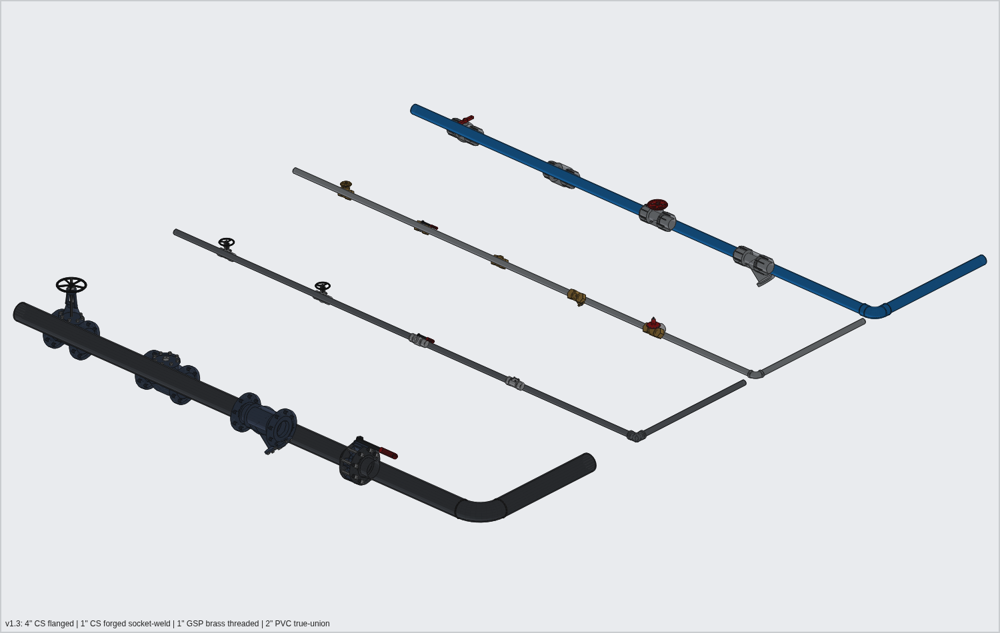

---

## คุณสมบัติหลัก

| กลุ่ม | ความสามารถ |
|---|---|
| **ท่อกลวงจริง** | ท่อมีความหนาผนังตามมาตรฐาน · ท่อสวม (PVC/PP-R/ทองแดง) มีบ่าข้อต่อ (socket hub) และท่อเสียบลึกเข้าข้อต่อตามจริง · ข้อต่อเกลียว (GSP) มีแถบขอบ (banded) · ท่อเหล็กเชื่อมมีแนวเชื่อม · HDPE มีแนว bead เชื่อมชน |
| **สแนป Center ปลายท่อ (v1.9)** | ชี้ที่ขอบหรือหน้าปลายท่อที่เปิดอยู่ → จับที่จุดศูนย์กลาง (ขึ้น *Center*) ทั้งตอนเริ่มและตอนจบเส้น · จบที่ปลายท่ออีกแนว = ต่อเป็นแนวเดียว (ขนาดต่าง = Reducer) |
| **วาดตามเส้นไกด์ (v1.6)** | จุดที่ snap กับเส้นขอบ / เส้นไกด์ / จุดไกด์ / จุดตัด ใช้ตำแหน่งนั้นตรง ๆ (การล็อก 45°/90° ใช้เฉพาะตอนเคอร์เซอร์ลอยอิสระ) |
| **สามทางจากข้องอ (v1.6)** | เริ่มหรือจบการวาดที่ข้องอ/สามทางเดิม → ข้อต่อนั้นกลายเป็นสามทาง/สี่ทางทันที ไม่ต้องวาดท่อตรงก่อน · ขนาดต่างกัน = สามทาง + ท่อสั้น + Reducer |
| **สีท่อเอง (v1.6)** | ติ๊ก *กำหนดสีท่อเอง* แล้วเลือกสี – ใช้กับท่อใหม่ และท่อที่เลือกเมื่อ *ปรับท่อที่เลือก* (ข้อต่อในแนวท่อเปลี่ยนสีตาม) |
| **HDPE แข็ง / ม้วน (v1.6)** | *แข็ง*: ท่อน 6 ม. + ข้อต่อหลอม (ในอาคาร/โรงงาน) · *ม้วน*: ดัดโค้งแทนข้องอ รัศมีไม่น้อยกว่า 25×OD (SDR11) / 27×OD (SDR17) ตาม PPI, ระยะไม่พอ → ใช้ข้องอหลอมไฟฟ้าและแจ้งเตือน, BOM นับเป็นม้วน (100 ม. ≤ 63 มม., 50 ม. 75–110 มม.) |
| **วาดท่อ** | คลิกจุดแนวศูนย์กลาง → ได้ท่อ + ข้องอ 90°/45° อัตโนมัติ · พิมพ์ความยาวได้ · ล็อกแกนด้วยลูกศร · ล็อกทิศ 45°/90° (ใช้ข้อต่อมาตรฐานเท่านั้น) · ท่อยืน (riser) ตั้งฉากพอดี |
| **แยกท่อ / ต่อท่อ** | คลิกจุดแรกบนท่อเดิม = สร้าง **Tee / Reducing Tee** อัตโนมัติ · คลิกที่ปลายท่อเดิม = วาดต่อจากท่อนั้น (ใส่ข้องอให้เอง) |
| **แปลงเส้นเป็นท่อ** | วาดด้วย Line tool หรือ trace จากแบบ CAD แล้วแปลงเป็นท่อ – รองรับ Tee, Cross, Lateral (Wye 45°) |
| **ปรับแบบภายหลัง** | เปลี่ยนขนาด / วัสดุ / ระบบ ของแนวท่อที่วาดแล้วได้ทันที – วาล์วและ Tee ที่แยกออกไปปรับขนาดตามให้ |
| **ท่อระบาย (Gravity)** | ใส่ความลาดให้อัตโนมัติตามทิศทางการวาด (= ทิศทางการไหล) พร้อมเตือนความลาดต่ำกว่า IPC 704.1 |
| **อุปกรณ์จริง (v1.5)** | **666 รายการคัดลอก 1:1 จากไฟล์ตัวอย่างที่ส่งมา** รวม **มิเตอร์น้ำ, ก๊อกน้ำ, เกจวัดแรงดัน 5 ช่วง** · ชี้ที่ท่อแล้วสแนปที่ *วงกลมปลายต่อ* ของอุปกรณ์ (ไม่ใช่จุดศูนย์กลางรูป) และ **ขนาดปรับตามท่อที่ชี้** · (ข้อต่อ GI เกลียว, เหล็ก Socket-weld/Butt-weld, หน้าแปลน, PVC ฟ้า มอก.17, PVC Sch40 ขาว, วาล์วเหล็กหล่อ/ทองเหลือง/พลาสติก, บัตเตอร์ฟลาย JIS 10K, เกจ, โฟลว์มิเตอร์) · ใช้อัตโนมัติตามวัสดุท่อ พร้อมหน้าแปลนประกบ · เปิดดู/วางเองได้จาก *คลังอุปกรณ์จริง* |
| **วาล์ว (แบบสร้างเอง)** | 8 แบบ รูปทรงต่างกันชัดเจน: Gate (ก้านยก + พวงมาลัยซี่), Globe (ตัวกลม), Ball (ด้ามโยก) / PVC True-union ball, Butterfly (lever < 6", gearbox ≥ 6"), Swing Check (ฝาเอียง + ลูกศรทิศทาง), Y-Strainer, PRV (ไดอะแฟรม + สปริง), หน้าแปลนคู่ + ปะเก็น + สลักเกลียว · ขนาดตาม ASME B16.10 / หน้าแปลน B16.5 Class 150 มีรูน็อตจริง |
| **ซัพพอร์ต** | แบบแขวน: Clevis + เหล็กเส้นเกลียว (พุกฝ้า/พื้น), Beam clamp, Trapeze รางยูนิสตรัท 41×41, แขวนจากท่อใหญ่ · แบบติดพื้น: Pipe stand ปรับระดับ, H-frame, Sleeper + pipe shoe, Wall bracket · วางอัตโนมัติตามระยะห่างสูงสุด (MSS SP-69) และยึดกับพื้น/ฝ้า/คาน/ผนังที่มีในโมเดลเอง · ปรับขนาดตามเมื่อเปลี่ยนขนาดท่อ |
| **ฉนวน** | แสดงฉนวนแบบโปร่งแสง (Tag แยก) และรวมในการตรวจการชนกันและ BOM |
| **คำนวณขนาดท่อ** | ใส่อัตราไหล → ตารางความเร็ว/แรงเสียดทานทุกขนาด พร้อมขนาดแนะนำ · ท่อระบายใช้ Manning ที่ความลึกครึ่งท่อ |
| **ตรวจไฮดรอลิก** | ความเร็ว, แรงเสียดทาน (Darcy–Weisbach), ΣK ข้อต่อ/วาล์ว, ระดับสูง-ต่ำ, head รวม (m / bar) · ท่อดับเพลิงแสดง Hazen–Williams ด้วย · หา **จุดสูง/จุดต่ำ** แล้วแนะนำ Air vent / Drain / Steam trap |
| **ตรวจการชนกัน** | ตรวจระยะห่างระหว่างแนวท่อ (รวมฉนวนและหน้าแปลนวาล์ว) ทำเครื่องหมายตำแหน่งในโมเดล |
| **BOM** | ความยาวท่อ, **จำนวนท่อน** (เผื่อเศษตัด), น้ำหนัก (kg), ข้องอ/Tee/วาล์วแยกตามชนิด-ขนาด, ฉนวน, จำนวนรอยต่อโดยประมาณ → CSV เปิดใน Excel ภาษาไทยได้ทันที |
| **สี & ลายเส้น** | ค่าเริ่มต้น **สีตามวัสดุจริง** (PVC ฟ้า, PP-R เขียว, HDPE ดำ, เหล็กดำ, สแตนเลส, GSP, ทองแดง; ท่อดับเพลิงแดง, ท่อก๊าซเหลือง ตามสีทาจริง) · สลับเป็น แยกสีตามระบบ / ASME A13.1 / JIS Z 9102 ได้ทันที · ปุ่ม *ลายเส้นเทคนิค* เส้นขอบดำคมแบบแบบก่อสร้าง |
| **ความละเอียด 2 ระดับ** | *ละเอียด* (รูน็อต, ซี่พวงมาลัย, บ่าข้อต่อ, แนวเชื่อม) สำหรับนำเสนอ · *เบา* สำหรับโมเดลโรงงานขนาดใหญ่ · ข้อต่อ/วาล์วเป็น Component ใช้ซ้ำ ไฟล์ไม่หนัก |
| **หมายเลขท่อ** | อัตโนมัติรูปแบบ `SIZE-SERVICE-SEQ` เช่น `4"-FP-003` แยกลำดับตามระบบ |

## การติดตั้ง

1. ต้องใช้ **SketchUp 2021 ขึ้นไป** (Windows / macOS)
2. ดาวน์โหลดไฟล์ `dist/artk_plant_pipe-1.9.1.rbz`
3. SketchUp → **Extensions → Extension Manager → Install Extension** → เลือกไฟล์ `.rbz`
4. จะมีเมนู **Extensions → Plant Piping TH** และ Toolbar "Plant Piping TH"

> สร้างไฟล์ `.rbz` เองจากซอร์ส: `ruby tools/build_rbz.rb`

**อัปเดตเวอร์ชัน:** ไม่ต้อง Uninstall – Install Extension ไฟล์ใหม่ทับได้เลย แล้วเปิด SketchUp ใหม่ ·
ท่อที่วาดด้วยเวอร์ชันเก่าอยู่ในไฟล์ .skp ไม่หาย และเวอร์ชันใหม่อ่าน/สแนป/วาดต่อได้ (แปลงข้อมูลอัตโนมัติเมื่อเปิดไฟล์ –
ดู [docs/DATA_FORMAT.md](docs/DATA_FORMAT.md)) · กด *ปรับท่อที่เลือก* เพื่อให้ท่อเก่าได้อุปกรณ์รุ่นใหม่

## เริ่มใช้งาน (ลำดับงานที่แนะนำ)

1. **ตั้งค่า** (ไอคอนเฟือง) → เลือก *ระบบท่อ* เช่น `FP – ท่อดับเพลิง` ระบบจะเลือกวัสดุ/ขนาด/ฉนวนเริ่มต้นที่เหมาะสมให้ ปรับเปลี่ยนได้
2. แท็บ **คำนวณขนาด** → ใส่อัตราไหล → กด *ใช้ขนาดแนะนำ*
3. **วาดท่อ** → คลิกจุดตามแนวท่อ → ดับเบิลคลิกหรือ Enter เพื่อจบ
4. **คลังอุปกรณ์จริง** → เลือกอุปกรณ์ → ชี้ที่ท่อ (วาล์ว/มิเตอร์ = บนท่อตรง, ข้องอ/ก๊อก/ฝาครอบ = ปลายท่อ, เกจ = บนท่อ)
5. เลือกแนวท่อ → **กำหนดอัตราไหล** → **ตรวจไฮดรอลิก**
6. เลือกแนวท่อ → **วางซัพพอร์ตอัตโนมัติ** (หรือใช้ Support tool วางทีละจุด / Trapeze คลุมหลายท่อ)
7. **ตรวจการชนกัน** → แก้ไขแนวท่อ
8. **ถอดวัสดุ (BOM)** → Export CSV (รวมซัพพอร์ต เหล็กเส้นเกลียว และรางยูนิสตรัทเป็นเมตร)

### ขนาดท่อทำงานอย่างไร (สำคัญ)

- ขนาด/วัสดุ/ชั้นท่อในหน้าต่างตั้งค่า ใช้กับ **ท่อที่จะวาดใหม่** — แถบสถานะด้านล่างและตัวเลขข้างเคอร์เซอร์จะแสดงขนาดที่กำลังวาดเสมอ
- **เริ่มวาดที่ปลายท่อเดิม:**
  - ขนาดเดียวกัน → วาดต่อเป็นแนวเดียวกัน (ไม่มีรอยต่อ)
  - ขนาด/วัสดุต่างกัน → ใส่ **Reducer** (ตาม ASME B16.9) แล้วเริ่มแนวท่อใหม่ขนาดที่เลือก; ถ้าเลี้ยวด้วย ท่อเดิมจะได้ข้องอก่อน Reducer อัตโนมัติ
- **เปลี่ยนขนาดท่อที่วาดไปแล้ว:** เลือกแนวท่อ → ตั้งขนาดใหม่ → *ปรับท่อที่เลือก (Rebuild)* — วาล์ว ซัพพอร์ต และ Tee ที่แยกออกไปปรับตาม
- ถ้าท่อมีช่องว่าง/ข้อต่อหาย ให้รัน **Extensions → Plant Piping TH → Diagnostics** แล้วส่งภาพรายงานมา

### วางอุปกรณ์จากคลัง – สแนปที่วงกลมปลายต่อ (v1.5)

| ชนิด | ชี้ที่ | สแนปอย่างไร |
|---|---|---|
| วาล์ว, ยูเนี่ยน, มิเตอร์น้ำ, โฟลว์มิเตอร์, สเตรนเนอร์ … (ปลายต่อ 2 ข้างแนวเดียวกัน) | ท่อตรง | วงกลมปลายต่อทั้งสองข้างวางบนแกนท่อ ก้าน/หัวขับชี้ขึ้น · อยู่กับแนวท่อเมื่อ Rebuild |
| ข้องอ, สามทาง, ฝาครอบ, หน้าแปลน, ก๊อกน้ำ … | ปลายท่อที่เปิดอยู่ | วงกลมปลายต่อแรกประกบปลายท่อ (ข้อต่อสวม: ท่อเสียบถึงก้นซ็อกเก็ต) · ← → หมุน 90° |
| เกจวัดแรงดัน | บนท่อ | เกลียวใต้เกจติดผิวบนของท่อ หน้าปัดหันหาผู้ดู · ขนาดเกจคงเดิม (Ø100) |

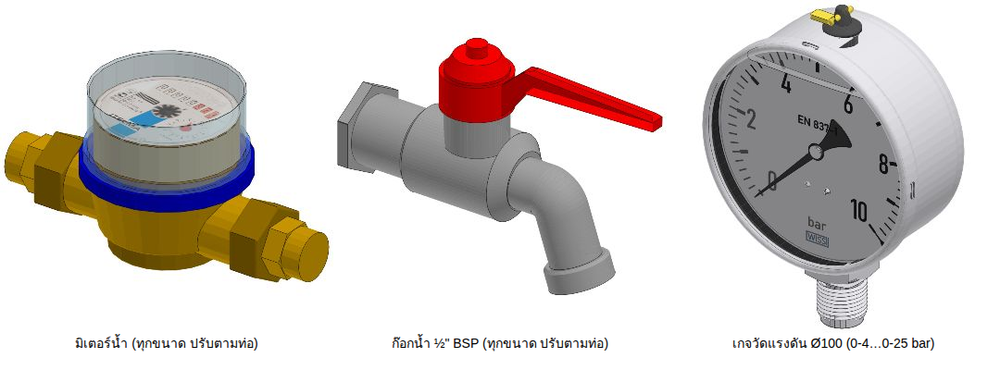

**ขนาดตามท่อ:** ถ้าในคลังมีรุ่นเดียวกันขนาดเท่าท่อ จะใช้ตัวนั้น (เช่น เลือกบัตเตอร์ฟลาย 8" แต่ชี้ท่อ 4" → ได้ตัว 4" จริง)

**มิเตอร์น้ำ / ก๊อก – ขนาดมาตรฐาน (v1.7):** ไม่ขยายทั้งชิ้นตามท่ออีกต่อไป
- มิเตอร์น้ำ (multi-jet เกลียว) DN15–DN50 (½"–2") ความยาว L ตาม **ISO 4064**: 165 / 190 / 260 / 260 / 300 / 300 มม. ·
  ขยายตามท่อเฉพาะส่วนต่อท่อ (บ่า ยูเนี่ยน หาง) ส่วนตัวเรือนและหน้าปัดโตตามขนาดมิเตอร์จริง (DN50 ≈ 1.8 เท่าของ DN15 ไม่ใช่ 2.8 เท่า)
- ท่อ 2½"–12" (DN65–300): มิเตอร์ใบพัด **Woltman หน้าแปลน PN16** (v1.8) สร้างจากขนาดมาตรฐาน – L ตาม ISO 4064
  (200 / 225 / 250 / 250 / 300 / 350 / 450 / 500 มม.), หน้าแปลน/วงโบลท์ตาม EN 1092-2 PN16, หัวอ่านขนาดเดียวทุกไซซ์ (ไม่มีฝา)
  พร้อมหน้าแปลนประกบบนท่อ · (v1.9) สีตัวเรือนเหมือนวาล์ว, โบลท์ทะลุสองหน้าแปลนตรงรูของหน้าแปลนประกบ
  (หัวโบลท์ ISO 4014 + แหวน ISO 7089 + น็อต ISO 4032 ลบมุม + ปลายเกลียวโผล่) · ใหญ่กว่า 12" ไม่สแนป (มิเตอร์เก่าบนท่อนั้นยังอยู่ – แจ้งเตือน ไม่ลบ)

  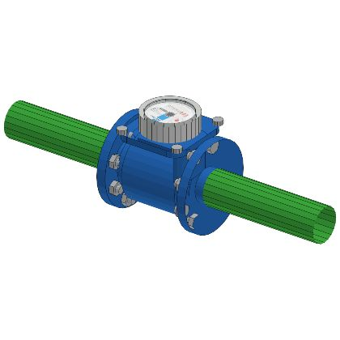
- ก๊อกน้ำมี ½" ¾" 1" · ท่อใหญ่กว่านั้นให้ลดขนาดก่อน

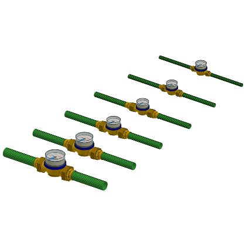

ก๊อกน้ำในไฟล์ถูกวาดใหญ่เกินจริงราว 12 เท่า → ปรับให้เกลียว = ½" BSP (20.96 mm) ก่อนใช้ ·
หน้าปัดมิเตอร์เป็นรูปภาพ (texture) คัดลอกมาพร้อมตำแหน่งเดิม · กระจกโดม/เกจเป็นวัสดุโปร่งใสตามไฟล์

### คลังอุปกรณ์จริง – คัดลอกจากไฟล์ตัวอย่าง (v1.4)

ไฟล์ `.skp` ที่ส่งมา 4 ไฟล์ (ท่อ/ข้อต่อเหล็ก-GI, FITTING_PVC, Schedule 40, VALVEDATABASE) ถูกอ่านโดยตรง
(ไฟล์ SketchUp 2021+ เป็น ZIP ที่มี `model.dat` – เขียนตัวอ่านเองใน `tools/refs/`) แล้ว **คัดลอกรูปทรงทุกหน้าแบบ 1:1**
(หน้าที่มีรู, ขอบนุ่ม, สีวัสดุเดิม) ครบทุกชิ้นที่วางอยู่ในไฟล์ รวม **659 รายการ**
แต่ละชิ้นถูกหา *จุดต่อ* จากรูปทรงเอง (หน้าปลายวงแหวนที่ปลายสุด: ปากซ็อกเก็ต, หน้าเชื่อม, หน้า raised face)
และวัดความลึกซ็อกเก็ต เพื่อให้ท่อสวมเข้าถึงก้นซ็อกเก็ตพอดี

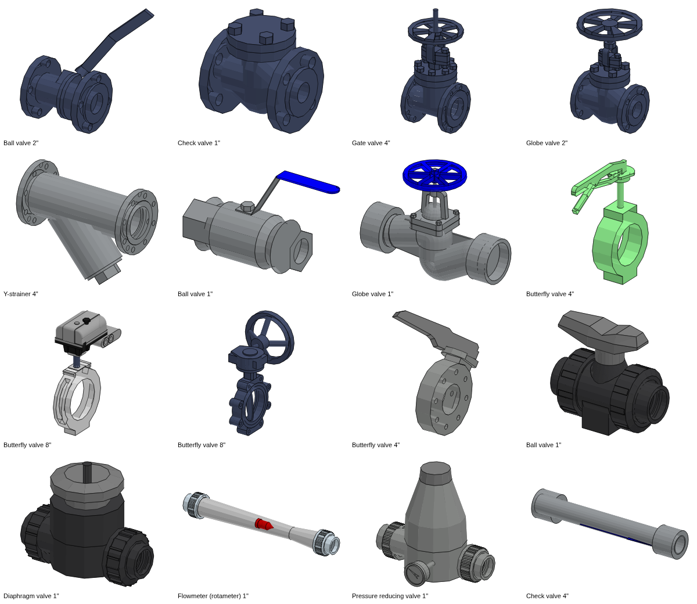
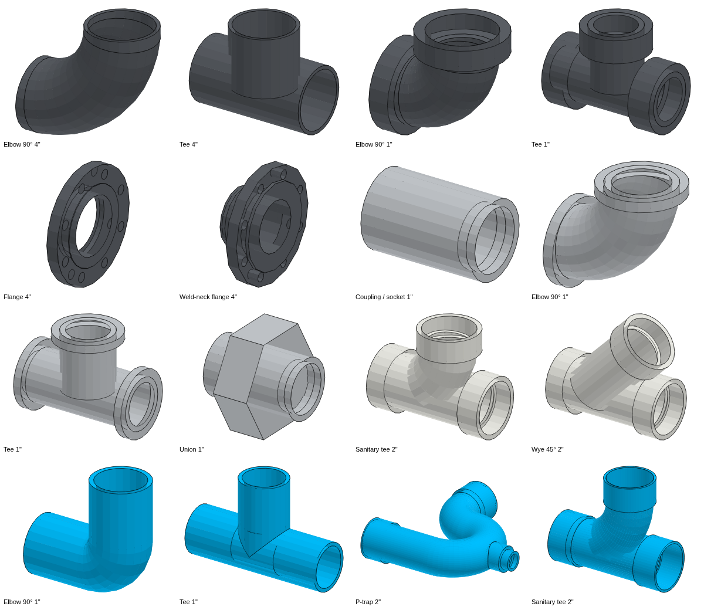

**แยกแยะวัสดุ / ชนิด (เหตุผล)**

| กลุ่มในไฟล์ | คืออะไร | วัสดุ / สีที่ใช้ |
|---|---|---|
| `… - THRD.` (Elbow, Tee, Coupling, Union, Cap, Hex/Pipe nipple) | ข้อต่อ **GI เกลียว** ใช้กับท่อ GSP มอก.277 | เหล็กหล่อเหนียวชุบสังกะสีร้อน (EN 10242) – สีเงินด้าน |
| `Ball/Globe/Check/Strainer - THRD.` | วาล์วเกลียวสำหรับงาน GI | ทองเหลือง/บรอนซ์ |
| `… - SW` | ข้อต่อ/วาล์ว **Socket weld 3000#** (ASME B16.11) สำหรับเหล็ก < 2" | เหล็กตีขึ้นรูป A105 – สีเหล็กดำ |
| `… - BW,LR`, `Tee/CAP - BW` | ข้อต่อ **เชื่อมชน** (ASME B16.9) สำหรับเหล็ก ≥ 2" | A234 WPB – สีเหล็กดำ |
| `Flange - SO,150#` / `SO,PN`, `Flange Blind`, WN flange | หน้าแปลนสวม/ปิด/คอเชื่อม (B16.5 Class 150 / EN 1092 PN16) | A105 |
| Gate/Globe/Ball/Check flanged (VALVEDATABASE) | วาล์วเหล็กหล่อ **หน้าแปลน Class 150** (ASME B16.34/B16.10) | เหล็กหล่อ WCB ทาสีน้ำเงินเทา |
| วาล์วปีกผีเสื้อ JIS10K / Electrically operated | **บัตเตอร์ฟลาย Wafer JIS 10K** ก้านโยก / หัวขับไฟฟ้า – ประกบระหว่างหน้าแปลน | เหล็กหล่อเหนียว (FCD) เคลือบอีพ็อกซีเขียว |
| ABZ body + handle/gear | บัตเตอร์ฟลาย **Lug** Class 150 ก้านโยก / เกียร์ (API 609) | เหล็กหล่อเหนียว |
| Dual-plate wafer | เช็ควาล์วแบบ wafer (API 594) | เหล็กหล่อ |
| `Elbows / Tee-90 … thick`, `Socket`, `REDUCING SOCKET` | PVC **ฟ้า มอก.17 แบบหนา** (งานน้ำดี/แรงดัน) | PVC-U สีฟ้า |
| `Elbows … Long/Short`, `Tee-TY`, `Tee-Y 45`, `P/U-TRAP` | PVC ฟ้า **แบบบาง/ระบายน้ำ** (สามทางวาย, วาย 45°, ข้องอรัศมียาว-สั้น, ท่อดักกลิ่น) | PVC-U สีฟ้า |
| `…sch-40` (L_90, S_90, T_90, X_90, Y_45, YY_45, Socket, R) | PVC **Sch40 DWV** (ASTM D2665) สีขาว | PVC-U สีขาว |
| TN^UGf, PRV^Body, VM^Body, VBU^…PN10, Asahi handle/gear | ของพลาสติก (GF/Asahi): โฟลว์มิเตอร์, วาล์วลดแรงดันพร้อมเกจ, **ไดอะแฟรมวาล์ว** (PP-H/PE), บอลวาล์ว true-union, **บัตเตอร์ฟลาย PVC หน้าแปลน PN10** | PVC-U เทา / PP ดำ ตามไฟล์ |

**ใช้อัตโนมัติ** (ระดับรายละเอียด *ละเอียด*) – เลือกตามวัสดุท่อที่วาด:

| ท่อ | ข้องอ / Tee | วาล์ว |
|---|---|---|
| GSP (GI) | ข้อต่อ GI เกลียว | Ball/Globe/Check/Strainer ทองเหลืองเกลียว · Gate เหล็กหล่อหน้าแปลน · Butterfly JIS 10K |
| เหล็ก/สแตนเลส < 2" | Socket weld 3000# | Ball SW · Gate/Globe/Check หน้าแปลน |
| เหล็ก/สแตนเลส ≥ 2" | Butt weld LR (A = 1.5D ตาม B16.9) | Gate/Globe/Ball หน้าแปลน · **Butterfly JIS 10K ก้านโยก ≤ 8"**, Lug เกียร์ ≥ 10" · Check แบบ wafer |
| PVC มอก.17 | ฟ้าแบบหนา (≤ 2") / แบบบาง (> 2") | Ball true-union · Butterfly PVC PN10 · Gate/Globe → **ไดอะแฟรมวาล์ว** (PVC ไม่มีเกทวาล์ว) · PRV |
| PVC Sch40 | Sch40 DWV ขาว | เหมือน PVC |

- วาล์วหน้าแปลน/wafer/lug ได้ **หน้าแปลนประกบ (slip-on) 2 ข้าง** อัตโนมัติ และนับใน BOM
- ระยะท่อที่ตัดคำนวณจากระยะจริงของข้อต่อนั้น (A, C) และท่อเสียบถึงก้นซ็อกเก็ตจริง
- เกทวาล์วจริงมีในไฟล์เฉพาะ ½"–4": ขนาดใหญ่กว่าใช้โมเดล 4" ปรับสเกล *ตามแนวท่อ = ระยะหน้าต่อหน้า B16.10* และ *ตามขวาง = ขนาดหน้าแปลน B16.5* (ระบุ `model_scaled_from` ในข้อมูลชิ้น)
- ขนาด/ชนิดที่ไม่มีในไฟล์ → ใช้แบบที่ปลั๊กอินสร้างเอง (เดิม) และแจ้งในข้อมูลชิ้น
- **คลังอุปกรณ์จริง** (ไอคอนใหม่บน Toolbar): ค้นหา/กรองตามระบบ-ขนาด เห็นภาพทุกชิ้น คลิกเพื่อวาง –
  อุปกรณ์อินไลน์ (วาล์ว, ยูเนี่ยน, โฟลว์มิเตอร์, สเตรนเนอร์, สตีมแทรป…) **สแนปเข้าท่อขนาดเดียวกัน** และอยู่กับแนวท่อเมื่อ Rebuild ·
  ชิ้นอื่นวางอิสระ (← → หมุน 90°)

> โมเดลเหล่านี้มาจากไฟล์ที่คุณส่งมา (ต้นทางเช่น 3D Warehouse / TraceParts / GF) – ใช้ในงานของคุณได้ตามเดิม
> ถ้าจะเผยแพร่ปลั๊กอินต่อสาธารณะ ควรตรวจเงื่อนไขลิขสิทธิ์ของต้นทางก่อน

### เพิ่มอุปกรณ์เข้าคลัง

อุปกรณ์ใหม่ (รุ่น/ยี่ห้ออื่น) เพิ่มได้จากไฟล์ `.skp` ใด ๆ: ใส่ไฟล์ในคำสั่ง `tools/refs/extract.rb` (ดูหัวข้อสำหรับนักพัฒนา)
แล้วสร้าง `.rbz` ใหม่ – ตัวคัดลอกจะหาวงกลมปลายต่อ วัสดุ และขนาดให้เอง

### คีย์ลัดขณะวาดท่อ

| คีย์ | การทำงาน |
|---|---|
| คลิก | เพิ่มจุด |
| พิมพ์ตัวเลข + Enter | ความยาวตามทิศทางปัจจุบัน (ท่อระบาย = ความยาวในแปลน) |
| → / ← / ↑ | ล็อกแกนแดง / เขียว / น้ำเงิน · ↓ ปลดล็อก |
| Shift (กดค้าง) | ล็อกทิศทางปัจจุบัน |
| Backspace | ลบจุดล่าสุด |
| ดับเบิลคลิก / Enter | จบแนวท่อ |
| Esc | ยกเลิก |

**อ้างอิงระดับ BOP (Bottom of Pipe):** เมื่อคลิกบนพื้นผิว/ขอบ เช่น หลังคานรางท่อ (pipe rack) ท่อจะวางบนคานพอดี (ยกขึ้นครึ่ง OD)

## ซัพพอร์ตท่อ

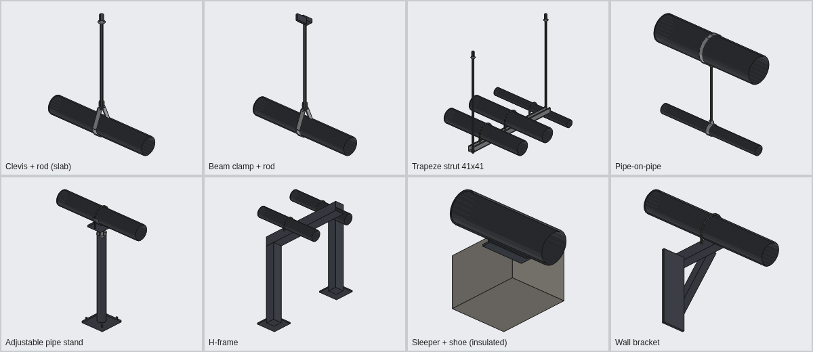

| ชนิด | ใช้เมื่อ | ยึดกับ |
|---|---|---|
| Clevis hanger + threaded rod | ท่อเดี่ยวแขวนใต้พื้น/ฝ้า | พุก (drop-in anchor) ที่ผิวคอนกรีตด้านบน |
| Beam clamp + rod | แขวนจากคานเหล็กหลังคาโรงงานโดยไม่เจาะ | ปีกล่างของคานเหล็ก |
| Trapeze (strut 41×41) | หลายท่อวิ่งขนานกัน | 2 ก้านแขวน + U-bolt ทุกท่อ |
| Pipe-on-pipe | ท่อเล็กแขวนจากท่อใหญ่ด้านบน | แคลมป์รัดท่อใหญ่ |
| Adjustable pipe stand | ท่อเดี่ยวใกล้พื้น | แผ่นเพลทยึดพุก 4 ตัว |
| H-frame / Goalpost | หลายท่อบนพื้น (pipe rack เล็ก) | เสา 2 ต้น + คาน |
| Sleeper + pipe shoe | ท่อร้อน/ท่อหุ้มฉนวน ต้องเลื่อนตัวได้ | คานคอนกรีตรองท่อ (shoe สูง = ฉนวน + 50 mm) |
| Wall bracket | ท่อเลียบผนัง | แขนค้ำ + ค้ำยันเฉียง 45° |

**ระยะห่างสูงสุด:** เหล็ก MSS SP-69 / ASME B31.1 (เช่น 1" = 2.1 m, 2" = 3.0 m, 4" = 4.3 m, 6" = 5.2 m) ·
ทองแดง MSS SP-69 · PVC/PP-R ค่าผู้ผลิตทั่วไป (PP-R ท่อร้อน × 0.6 เพราะคืบตัวที่อุณหภูมิสูง) · HDPE ≈ 12 × OD ·
ซัพพอร์ตแรก/สุดท้ายห่างข้อต่อไม่เกิน 600 mm และมีซัพพอร์ตใกล้วาล์วทุกตัว (น้ำหนักรวมจุด) ·
ขนาดเหล็กเส้นเกลียวตาม MSS SP-58 (≤ 2" = 3/8" M10 … 4" = 5/8" M16)

**ยึดกับโครงสร้างจริง:** ปลั๊กอินยิงแนวตรวจ (ray) จากท่อขึ้น/ลง/ด้านข้าง หาพื้น ฝ้า คาน หรือผนังที่มีในโมเดล
(ข้ามท่อของตัวเอง) — ถ้าไม่พบจะใช้ค่าสมมติและแจ้งเตือน ดังนั้นควรมีโครงสร้างอาคารในโมเดลก่อนวางซัพพอร์ต

## ระบบท่อที่รองรับ

| รหัส | ระบบ | วัสดุเริ่มต้น | หมายเหตุ |
|---|---|---|---|
| CW | น้ำประปา/น้ำเย็น | PVC มอก.17 ชั้น 13.5 | v ≤ 2.0 m/s |
| HW / HWR | น้ำร้อน / น้ำร้อนไหลกลับ | PP-R PN20 + ฉนวน 25 | v ≤ 1.5 m/s |
| SAN | น้ำเสีย/โสโครก | PVC ชั้น 8.5 | Gravity, ความลาดอัตโนมัติ |
| V | ท่ออากาศ (Vent) | PVC ชั้น 5 | |
| SD | ระบายน้ำฝน | PVC ชั้น 8.5 | Gravity |
| FP | ดับเพลิง | เหล็กดำ SCH40 | Hazen–Williams C=120 |
| CHWS / CHWR | น้ำเย็นจ่าย/กลับ (Chiller) | เหล็กดำ SCH40 + ฉนวน 50 | |
| CDW | น้ำหล่อเย็น Cooling tower | เหล็กดำ SCH40 | |
| PW | น้ำใช้ในกระบวนการผลิต | HDPE PE100 SDR11 | |
| DI | น้ำบริสุทธิ์ RO/DI | สแตนเลส 10S | |
| STM / CON | ไอน้ำ / คอนเดนเสท | เหล็กดำ SCH40 / SCH80 + ฉนวน | v ≤ 30 m/s (ไอน้ำ) |
| CA | ลมอัด | GSP มอก.277 | v ≤ 8 m/s |
| NG | ก๊าซเชื้อเพลิง | เหล็กดำ SCH40 | |
| CHM | สารเคมี | HDPE | |
| IWW | น้ำเสียโรงงาน | HDPE | |
| OIL | น้ำมัน | เหล็กดำ SCH40 | |
| VAC | สุญญากาศ | สแตนเลส 10S | |

## มาตรฐานท่อในแค็ตตาล็อก

| แค็ตตาล็อก | มาตรฐาน | ขนาด | ชั้น/Schedule |
|---|---|---|---|
| ท่อเหล็กดำ | ASME B36.10M | ½"–24" | SCH40, SCH80 |
| ท่อสแตนเลส | ASME B36.19M | ½"–24" | 5S, 10S, 40S |
| ท่อเหล็กอาบสังกะสี (GSP) | BS 1387 Medium / มอก.277 | ½"–6" | Medium |
| ท่อ PVC | มอก.17-2532 | ½"–12" | ชั้น 5, 8.5, 13.5 ⚠ |
| ท่อ PP-R | DIN 8077 / ISO 15874 | 20–110 mm | PN10, PN16, PN20 |
| ท่อ HDPE PE100 แบบแข็ง | ISO 4427 | 32–315 mm | SDR17 (PN10), SDR11 (PN16) |
| ท่อ HDPE PE100 แบบม้วน | ISO 4427 | 20–110 mm | SDR11 (PN16), SDR17 (PN10 ≥ 32 mm) |
| ท่อ PVC Sch40 (ขาว) | ASTM D1785 | ½"–4" | SCH40 |
| ท่อทองแดง | ASTM B88 Type L | ½"–4" | Type L |

⚠ **ท่อ PVC:** OD เป็นไปตาม มอก.17 แต่ **ความหนาผนังเป็นค่าประมาณ** จากสูตรแรงดัน (ตรวจสอบกับค่าในแค็ตตาล็อก 4" แล้ว คลาดเคลื่อน ≤ 0.2 mm)
ปลั๊กอินแสดงคำเตือนและใส่หมายเหตุใน BOM – ควรตรวจสอบกับแค็ตตาล็อกผู้ผลิตก่อนสั่งซื้อ หรือเพิ่มแค็ตตาล็อกของผู้ผลิตเอง (ด้านล่าง)

ข้อต่อเหล็ก: รัศมีข้องอ Long Radius / Short Radius และระยะ Tee ตาม **ASME B16.9 / B16.28** ·
วาล์ว: ระยะหน้าต่อหน้า **ASME B16.10 Class 150** ·
หน้าแปลน: **ASME B16.5 Class 150** (OD, ความหนา, วงรูน็อต, จำนวนและขนาดรู, raised face, weld-neck hub) ·
ความลึกบ่าสวม ≈ ISO 727 (0.5·OD + 6 mm)

### วาล์ว 4 ตระกูลตามชนิดท่อ (v1.3)

ปลั๊กอินเลือกแบบวาล์วให้ตรงกับที่ใช้จริงกับท่อนั้นอัตโนมัติ — ความยาวหน้าต่อหน้าก็ต่างกันตามตระกูล:

| ท่อ | ตระกูลวาล์ว | ลักษณะ |
|---|---|---|
| เหล็ก/สแตนเลส ≥ 2" | หน้าแปลนเหล็กหล่อ (Class 150) | ตัวหล่อรูปไข่, ฝาครอบยึดน็อต, Yoke + ก้านยก, พวงมาลัยซี่ |
| เหล็ก/สแตนเลส < 2" | เหล็กตีขึ้นรูป Socket-weld (Class 800) | บล็อกตัววาล์ว, ฝาสี่เหลี่ยมยึดน็อต 4 ตัว, โครง Yoke — ข้อต่อเป็น forged SW (B16.11) |
| GSP / ทองแดง | ทองเหลืองเกลียว | ปลายหกเหลี่ยม, ฝาหกเหลี่ยม, พวงมาลัยทองเหลืองมีรู, บอลวาล์วชุบโครเมียมด้ามยาวหุ้มยาง |
| PVC / PP-R / HDPE | True-union พลาสติก | แหวนยูเนียนมีครีบ, ด้าม T / พวงมาลัยพลาสติก |

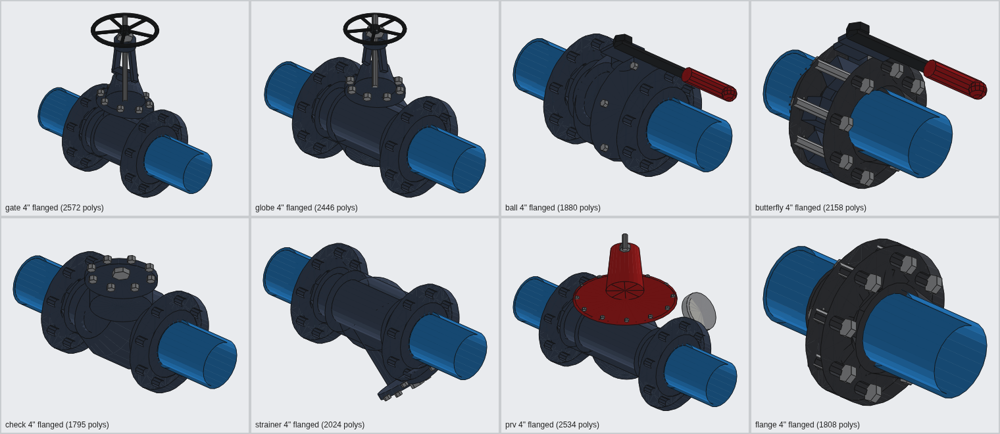
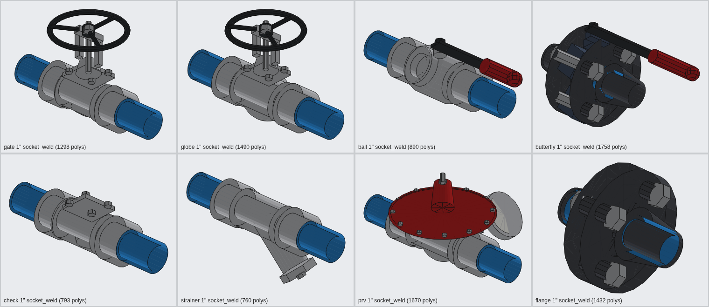
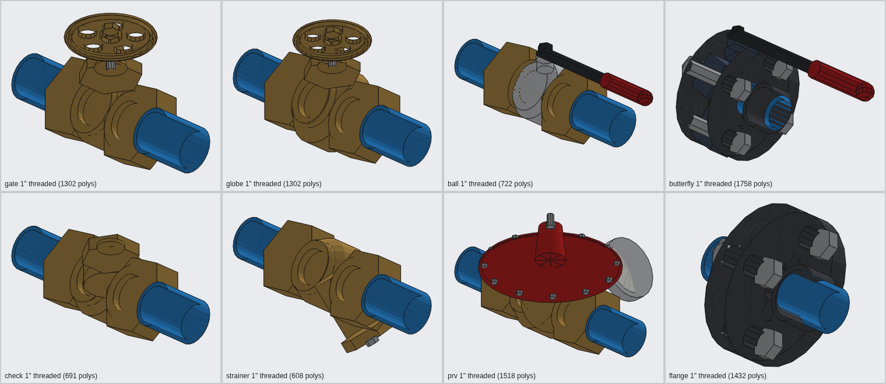
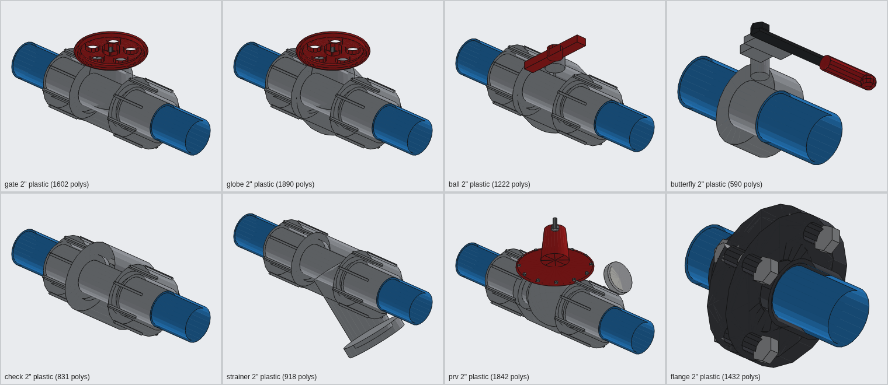

### เพิ่มแค็ตตาล็อกท่อของผู้ผลิตเอง

สร้างไฟล์ `custom_catalog.json` ไว้ในโฟลเดอร์ปลั๊กอิน (`…/Plugins/artk_plant_pipe/`) ตามรูปแบบ
[`docs/custom_catalog.example.json`](docs/custom_catalog.example.json) แล้วเปิด SketchUp ใหม่

## หลักการคำนวณ

- **ท่อแรงดัน (ของเหลว):** Darcy–Weisbach + Swamee–Jain (ใช้ได้ทุกอุณหภูมิ ต่างจาก Hazen–Williams ที่ใช้ได้กับน้ำเย็นเท่านั้น) ·
  เกณฑ์เริ่มต้น v ≤ 2.0–2.4 m/s และแรงเสียดทาน ≤ 4 m/100 m
- **ท่อดับเพลิง:** แสดง Hazen–Williams (C=120) เพิ่ม ตามแนวทาง NFPA 13
- **Minor loss:** วิธี K (ค่าทั่วไปจาก Crane TP-410) ข้องอ LR 0.3, SR 0.5, 45° 0.2, Tee ผ่านตรง 0.3 / แยก 1.0, Gate 0.15, Globe 6, Check 2 …
- **ท่อระบาย:** Manning n = 0.011 ที่ความลึกครึ่งท่อ · ความลาดต่ำสุดตาม IPC ตาราง 704.1 (< 3" = 2.08%, 3"–6" = 1.04%, ≥ 8" = 0.52%) · ความเร็วชำระล้าง ≥ 0.6 m/s
- **ก๊าซ/ไอน้ำ/ลม:** ตรวจความเร็วเท่านั้น (ใส่อัตราไหลจริงที่ความดันใช้งาน)
- **จุดสูง/ต่ำ:** ท่อน้ำ → Air release valve ที่จุดสูง, Drain ที่จุดต่ำ · ไอน้ำ → Drip leg + Steam trap · ลมอัด → Auto drain · ท่อระบาย → ท้องช้าง/ลาดย้อน = ผิดพลาด

## ข้อมูลในโมเดล

- แต่ละแนวท่อเป็น **Group** ชื่อ = หมายเลขท่อ ภายในแยกเป็นกลุ่มย่อยต่อชิ้น (ท่อ ข้องอ Tee วาล์ว ฉนวน)
- ข้อมูลทั้งหมดเก็บใน Attribute dictionary `ArtK_PlantPipe` (อ่านได้จาก Generate Report ของ SketchUp)
- รูปแบบข้อมูลมีเลขเวอร์ชัน (`fmt`) – เวอร์ชันใหม่อ่านไฟล์เก่าได้เสมอ และแปลงให้อัตโนมัติ ([docs/DATA_FORMAT.md](docs/DATA_FORMAT.md))
- Tag: `PP-<ระบบ>` ต่อระบบ, `PP-Insulation`, `PP-Centerline`, `PP-Labels`, `PP-Clash`, `PP-Check Markers` (อยู่ในโฟลเดอร์ Tag "Plant Piping")

## ข้อจำกัด (ควรทราบ)

- อุปกรณ์จริงมีเฉพาะขนาด/ชนิดที่อยู่ในไฟล์ตัวอย่าง ที่เหลือเป็นแบบพาราเมตริก · หน้าแปลนประกบของบัตเตอร์ฟลาย JIS 10K / PVC ใช้โมเดลหน้าแปลน PN16 ที่มีในไฟล์ (ไม่มี JIS 10K / PVC flange ในไฟล์)
- ท่อยังวาดต่อเนื่องผ่านตัววาล์ว (ซ่อนอยู่ในตัววาล์ว) – ความยาวท่อใน BOM จึงรวมช่วงวาล์วด้วย (เผื่อเล็กน้อย)
- ข้อต่อ GI เกลียวในไฟล์ตัวอย่างมีรูใน = รูท่อเหล็ก (ไม่มีเกลียวใน) ท่อจึงชนที่หน้าข้อต่อ ไม่ได้เสียบเข้า
- ไม่ใช่แบบ fabrication/spool
- ซัพพอร์ตยังเป็นแบบพาราเมตริก (เพราะความยาวก้านแขวน/ขาตั้งต้องปรับตามหน้างาน)
- Trapeze/H-frame ที่ท่อต่างระดับ: รางอยู่ใต้ท่อต่ำสุด ท่อที่สูงกว่าต้องใช้แผ่นรอง (ไม่ได้วาด) · ท่อแนวตั้งต้องใช้ riser clamp ที่ระดับพื้น (แจ้งจำนวน แต่ยังไม่วาด)
- Trapeze/H-frame เป็นกลุ่มแยก ไม่ปรับตามอัตโนมัติเมื่อเปลี่ยนขนาดท่อ (ซัพพอร์ตท่อเดี่ยวปรับตามให้)
- ถ้าย่อ/ขยาย (Scale) กลุ่มท่อด้วยมือ ความยาวใน BOM จะไม่ตรง – ให้ใช้ *ปรับท่อที่เลือก* แทน
- Tee ภายในแนวท่อคิดการไหลแบบผ่านตรงในการตรวจไฮดรอลิก

## สำหรับนักพัฒนา

```
src/artk_plant_pipe.rb          ตัวโหลด extension
src/artk_plant_pipe/lib/        แกนคำนวณ + เรขาคณิต mesh/ชิ้นส่วน/ซัพพอร์ต (Ruby ล้วน – ทดสอบได้)
src/artk_plant_pipe/su/         ส่วนเชื่อมต่อ SketchUp (builder, tools, dialogs)
src/artk_plant_pipe/ui/         หน้าต่างตั้งค่า (HtmlDialog)
test/                           Minitest + stub ของ SketchUp API
tools/build_rbz.rb              สร้างไฟล์ .rbz
tools/refs/                     ตัวอ่านไฟล์ .skp + สร้างคลังอุปกรณ์จริง (refs.json/refs.bin) + ภาพตัวอย่าง
src/artk_plant_pipe/refs/       คลังอุปกรณ์จริงที่สร้างแล้ว (666 ชิ้น + texture + ภาพตัวอย่าง)
```

สร้างคลังใหม่จากไฟล์ .skp (เช่นเมื่อเพิ่มอุปกรณ์ในไฟล์ตัวอย่าง):

```bash
ruby tools/refs/extract.rb src/artk_plant_pipe/refs piping.skp FITTING_PVC.skp Schedule_40.skp VALVEDATABASE.skp \
     water_meter.skp faucet.skp pressure_gauge.skp
ruby tools/refs/thumbs.rb /tmp/scenes && node tools/refs/thumbs.js /tmp/scenes src/artk_plant_pipe/refs/thumbs
```

```bash
gem install minitest rake
rake test       # 135 tests (~10,000 assertions) – ทุกชิ้นส่วนถูกตรวจว่าเป็นทรงตันปิด ผิวหันออกถูกทิศ
rake package    # dist/artk_plant_pipe-<version>.rbz
```

เหตุผลการออกแบบและแนวคิดต่อยอด: [docs/DESIGN.md](docs/DESIGN.md)
