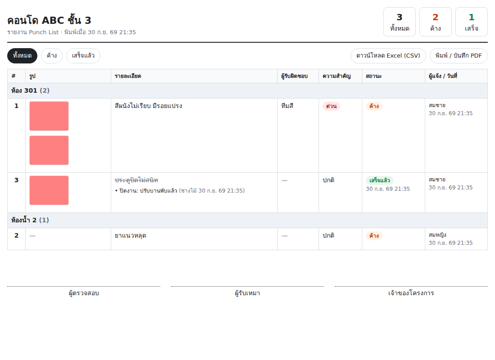

# Punch List LINE Bot 📋

บอทไลน์สำหรับทำ **punch list หน้างาน**: ถ่ายรูป → ส่งเข้ากลุ่มไลน์ → พิมพ์รายละเอียด → บอทบันทึกเป็นรายการพร้อมเลขที่ และจัดหน้ารายงาน (พิมพ์ PDF / Excel) ให้เลย

มี 2 แบบ:

| | **Google Sheets (แนะนำ)** | เซิร์ฟเวอร์ Node.js |
|---|---|---|
| โฟลเดอร์ | [`apps-script/`](apps-script/) | `src/` |
| ต้องมีเซิร์ฟเวอร์ | ไม่ต้อง (Google รันให้ ฟรี) | ต้องหาที่รันเอง |
| ข้อมูลอยู่ที่ | Google Sheet 1 ไฟล์ต่อโครงการ + รูปใน Google Drive | ไฟล์บนเซิร์ฟเวอร์ |
| ติดตั้ง | [คู่มือทีละขั้น](apps-script/README.md) ~15 นาที | ดูด้านล่าง |

คำสั่งในไลน์เหมือนกันทั้ง 2 แบบ ด้านล่างนี้คือคู่มือของแบบเซิร์ฟเวอร์ Node.js



## ใช้งานในไลน์

1. ส่งรูปหน้างาน (กี่รูปก็ได้)
2. พิมพ์ข้อความตามหลังรูป:
   ```
   ห้อง 301 / สีผนังไม่เรียบ @ทีมสี ด่วน
   ```
   - ก่อน ` / ` คือ **ตำแหน่ง** (รายงานจะจัดกลุ่มตามตำแหน่ง)
   - `@ชื่อ` คือ **ผู้รับผิดชอบ**
   - `ด่วน` คือ **ความสำคัญสูง**
3. บอทตอบกลับเป็นการ์ด `#1 สีผนังไม่เรียบ` พร้อมรูป

ข้อความคุยกันทั่วไปในกลุ่ม (ที่ไม่มีรูปส่งมาก่อน) บอทจะไม่สนใจ ถ้าอยากแจ้งแบบไม่มีรูปให้ขึ้นต้นด้วย `+` เช่น `+ ห้องน้ำ 2 / ยาแนวหลุด`

| คำสั่ง | ทำอะไร |
|---|---|
| `รายการ` | ดูงานค้าง |
| `ทั้งหมด` | ดูทุกรายการ |
| `รายงาน` | ลิงก์หน้ารายงานพร้อมรูป (กดพิมพ์ PDF / โหลด Excel ได้) |
| `เสร็จ 3` / `เสร็จ 3 หมายเหตุ` | ปิดรายการ #3 (ถ้าส่งรูปก่อน รูปนั้นจะแนบเป็นรูปหลังแก้) |
| `เปิด 3` | เปิดรายการ #3 ใหม่ |
| `#3 ข้อความ` | เพิ่มหมายเหตุในรายการ #3 |
| `ลบ 3` | ลบรายการ #3 |
| `ตั้งชื่อ คอนโด ABC ชั้น 3` | ตั้งชื่อหัวรายงาน |
| `ยกเลิก` | ล้างรูปที่ส่งค้างไว้ |
| `วิธีใช้` | แสดงวิธีใช้ |

แต่ละกลุ่มไลน์ = 1 โครงการ (แยกรายการ/เลขที่/ลิงก์รายงานกัน)

## ติดตั้ง

ต้องมี Node.js 18 ขึ้นไป ไม่ต้องติดตั้งแพ็กเกจเพิ่ม

1. สร้าง **Messaging API channel** ที่ [LINE Developers Console](https://developers.line.biz/console/)
   - คัดลอก **Channel secret** และออก **Channel access token (long-lived)**
   - ในแท็บ Messaging API: เปิด **Allow bot to join group chats**, ปิด **Auto-reply messages**
2. ตั้งค่า
   ```bash
   cp .env.example .env   # ใส่ LINE_CHANNEL_SECRET, LINE_CHANNEL_ACCESS_TOKEN, BASE_URL
   npm start
   ```
3. ต้องมี URL สาธารณะแบบ **https** (เช่น deploy บน Render / Railway / VPS หรือทดสอบด้วย `ngrok http 3000`)
   - ตั้ง `BASE_URL` เป็น URL นั้น
   - ตั้ง **Webhook URL** ใน LINE Console เป็น `https://<BASE_URL>/webhook` แล้วเปิด **Use webhook**
4. เพิ่มบอทเป็นเพื่อน แล้วเชิญเข้ากลุ่มหน้างาน

ข้อมูลและรูปเก็บในโฟลเดอร์ `DATA_DIR` (ค่าเริ่มต้น `./data`) ถ้า deploy บนโฮสต์ที่ดิสก์หายเมื่อรีสตาร์ท ให้ต่อ persistent disk ไว้ที่โฟลเดอร์นี้

ลิงก์รายงานมี token สุ่มต่อกลุ่ม คนที่มีลิงก์เท่านั้นถึงเปิดดูได้

## โครงสร้างโค้ด

```
src/server.js    HTTP server, webhook (ตรวจ signature), หน้ารายงาน/รูป/CSV
src/handlers.js  logic: รูป → ข้อความ → สร้างรายการ, คำสั่งต่าง ๆ
src/parser.js    แปลงข้อความเป็นคำสั่ง / ตำแหน่ง / รายละเอียด / ผู้รับผิดชอบ
src/flex.js      การ์ด Flex Message ที่ตอบในไลน์
src/report.js    หน้ารายงาน HTML (พิมพ์ A4) และ CSV
src/store.js     เก็บข้อมูลเป็น JSON
```

ทดสอบ: `npm test`
